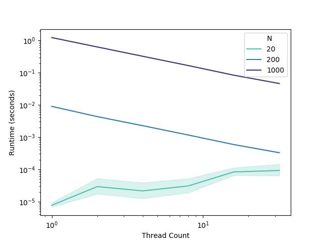

## What strategies could you use to add parallelism using OpenMP threading to this kernel?

You could do nested parallel for loops on the two outer for loops (i.e., fork parallel threads on the outer loop and then have *those* threads fork more parallel threads on the next loop).
I chose to do a parallel collapsed loop on the outer two for loops.
This way, MPI takes care of scheduling the work generated by the two outer for loops over a single pool of threads.

You might also use thread-level parallelism on the inner loop.
However, because each step in the inner for loop writes to the same variable, you have the potential for a race condition to occur.

## Is each of the three loops threadable?

All three of the loops *could* be threadable, however, for the inner loop you would need to use a reduce operation or make sure that the read/write on the shared variable is atomic.

If there's enough work generated via the outer two loops, it may be most efficient/simple to just thread parallelize the outer two loops.

## 1.

Modify your MMM code from ICA2 to implement OpenMP threading by adding appropriate compiler directives the outer loop of the MMM kernel.
Be sure to remove any MPI parallelism from your old code.
When compiling the OpenMP version of your code be sure to include the appropriate compiler flag (-fopenmp).

### response

Done!

## 2.
Compute the time-to-solution of your MMM code for 1 thread (e.g., export OMP_NUM_THREADS=1) to the non-OpenMP version (i.e., compiled without the -fopenmp flag).
Any matrix size N will do here.
Does it perform as you expect?
If not, consider the OpenMP directives you are using.

### response

With OMP_NUM_THREADS=1, the OpenMP and non-OpenMP executables each ran in about 27 seconds on my computer.

## 3.
Perform a thread-to-thread speedup study of your MMM code either on your laptop or HPCC. Compute the total time to solution for a few thread counts (in powers of 2): 1,2,4,...T, where T is the maximum number of threads available on the machine you are using. Do this for matrix sizes of N=20,100,1000.

### response

I performed the thread-to-thread speedup using a `salloc`'ed session on `dev-intel18`.

```
salloc  -N 1 -n 40 --time=00:30:00
```

I set the number of threads to 40, as was suggested in class.

```
export OMP_NUM_THREADS=40
```

You can find the raw data in `data.csv`.

## 4.
Plot the times-to-solution for the MMM for each value of N separately as functions of the the thread count T.
Compare the scaling of the MMM for different matrix dimensions.

### response

Here are time-to-solutions as a function of thread count, plotted log-log!
It was generated with `plot.py`.



For large problem sizes (e.g., `N=200,1000`) we see a linear relationship between runtime and thread count on the log-log plot.
Let's estimate the slope using the endpoints of the `N=1000` relationship.

```
m = (y_2 - y_1) / (x_2 - x_1)
  = (\log_{10}(0.046) - \log_{10}(1.22)) / (\log_{10}(32) - \log_{10}(1))
  = -0.946
```

```
\log_{10}(t) = -0.946 \log_{10}(T)
t = 1 / T^{0.946}
```

Ideally, we would like to have `m=-1`, but `m=-0.946` is pretty close to an ideal speedup!
Every time we double the number of threads, we at least come close to halving the run time.
More specifically, when we double the number of threads we reduce the runtime by a factor of `1/2^{0.946}=0.52`.

The trend for the small problem size (e.g., `N=20`) we observe a very different trend.
More threads *increases* runtime!
This is because the overhead of forking and joining threads outweighs the amount of work that can be parallelized for the small problem size.
The more threads that we have to fork and join, the longer our runtime!
