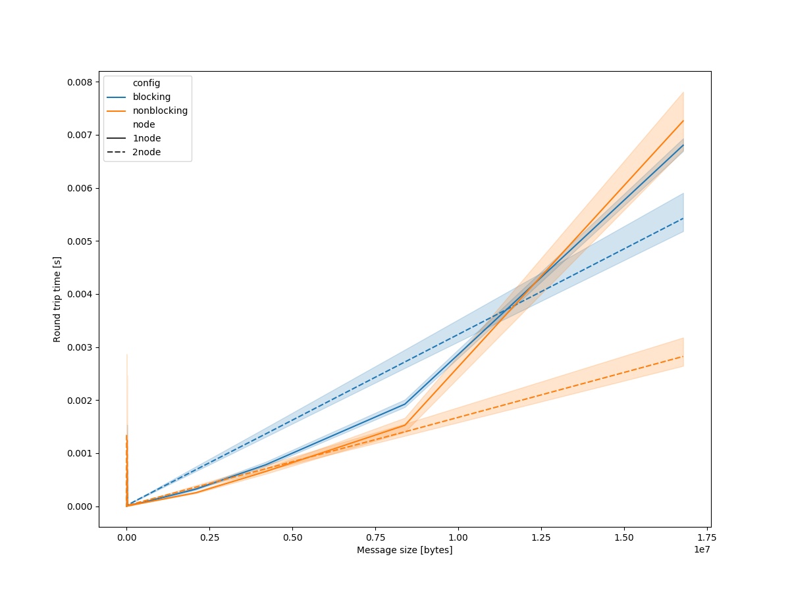

# ica6 writeup

Matthew Andres Moreno

I made two charts summarizing the results of the exercise.
The first is plotted on log-log axes.


The second is plotted on a linear-linear axes.



95% confidence intervals, based on the hundred replicates performed, are shaded in all of these plots.

Let's look at the log-log plot to get an estimate of latency.
Latency is basically "ping" time, the shortest possible time for a message round trip (i.e., with a very small message).
It reflects fundamental hardware (like message dispatching time) and physical constraints (i.e., speed of light).
Ideally, we would look for the round trip time of the smallest (i.e., 1 byte) message size to estimate latency.
Indeed, we can see (as we would expect) that latency between two processors within a node is less than the latency experienced by two processors on different nodes because more wiring and dispatching needs to be traversed by a message moving between different nodes.
We can estimate the latency between processors on the same node at around `0.9 \times 10^{-6}` seconds.

However, there seems to be lots of noise in the initial.
Looking at the data (i.e., `pingpong_nonblocking_2node.log`), the first five or ten replicates are very slow but then replicates speed up by a factor of `10^5`.
Perhaps this was due to some kind of transient network interruption or setup process.
Anyhow, we can still estimate latency between processors on different nodes despite this noise by just looking at slightly larger messages for the minimal observed message round trip size.
Although performance curves the non-blocking and blocking treatments differ somewhat, we can estimate the latency between processors on different nodes at around `1.1 \times 10^{-6}` seconds.

The linear-linear plot is useful for estimating bandwidth.
On this plot bandwidth (i.e., bytes per second) is just slope.
For each treatment, I will estimate bandwidth using a point on the left (approximately `(0,0)`) and an eyeballed point on the right through the slope formula

```
b = y_2 - y_1 / (x_2 - x _1)
  \approx y_2 / x_2
```

If we wanted to be more exacting, we could perform a formal linear regression on our observations.

For processors on two different nodes with nonblocking messaging, bandwidth is approximately
```
16777216 bytes / 0.002 seconds
= 8388608000 bytes / second
= 8.39 GB / second
```

For processors on two different nodes with blocking messaging, bandwidth is approximately
```
16777216 bytes / 0.005 seconds
= 3355443200 bytes / second
= 3.36 GB / second
```

On cursory inspection, the slope of the performance curve for one-node treatments appears to markedly increase on the right hand side of the graph (i.e., bandwidth decreases).
Perhaps, under the hood, within-node large messages need to be routed through a pathway with less bandwidth.
However, this should probably not be read too far into because the right hand side of the graph only represents the addition of a single observation (because the message size doubles between observations).

Because of this feature, I will estimate bandwidth estimates excluding the last observation (i.e., on 8388608 byte messages) for within-node messaging.

For very large messages processors on one node with blocking messaging, bandwidth is approximately
```
8388608 bytes / 0.0018 seconds
= 4660337778 bytes / second
= 4.66 GB / second
```

For processors on one node with nonblocking messaging, bandwidth is approximately
```
8388608 bytes / 0.0012 seconds
= 6990506667 bytes / second
= 6.99 GB / second
```

The roughly comparable bandwidth and latency for processors on two nodes and processors on one node speaks to the effectiveness of the HPCC's "InfiniBand" interlinks between nodes.

Finally, we can also use the results of these experiments to compare the bandwidth and latency of non-blocking and blocking messaging.
Looking at both the linear-linear and log-log charts (blue for blocking and orange for nonblocking), neither appears to be an obvious winner in terms of latency or bandwidth on both 1 and 2 nodes.
The number of nodes involved appears to be the more important factor.
